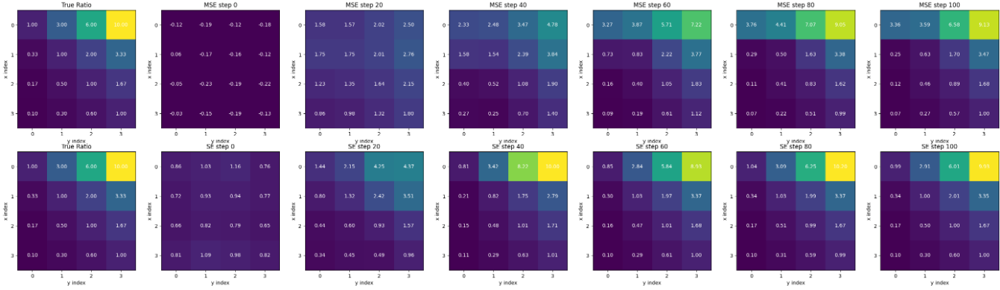

# Score Entropy Discrete Diffusion

This repo contains some simple demos for the paper [Discrete Diffusion Modeling by Estimating the Ratios of the Data Distribution](https://arxiv.org/abs/2310.16834). 

## Installation

Simply run
```
pip install -r requirements.txt
```
Or you can directly run these .ipynb files in Google Colab, without installing any packages.


## Compare Score Entropy Loss with MSE Loss in Concrete Score Matching
Concrete Score Matching (CSM) learns discrete scores using  $( s_\theta(x_t, t)_y - \frac{p_t(y)}{p_t(x)} )^2$. 

As noted in Score Entropy Discrete Diffusion (SEDD), the $\ell_2$ objective is incompatible with the requirement that $p_t(y)/p_t(x) > 0$. It does not strongly penalize zero or negative predictions, often causing unstable or divergent training. Thus, despite its theoretical appeal, CSM tends to struggle in practice.


To address these limitations, SEDD introduces the **Score Entropy Loss** as a replacement for the MSE objective:  $s_\theta(x_t, t)_y - \frac{p_t(y)}{p_t(x)}log(s_\theta(x_t, t)_y)$

In `sedd_vs_csm.ipynb`, we compare the two loss functions side by side, and the results are shown below.  
The top row corresponds to CSM and the bottom row to SEDD.  
The first column shows the target true ratio, while columns 2–7 display the learned ratios at steps 0, 20, 40, 60, 80, and 100, respectively.



We can see that SEDD learns the true ratio more efficiently and more robustly.
